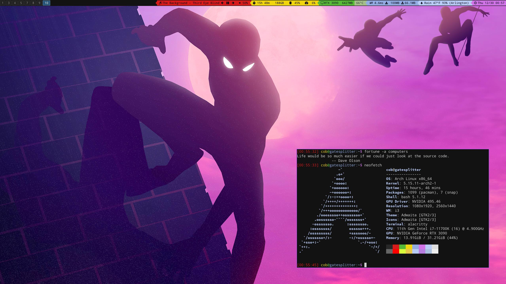
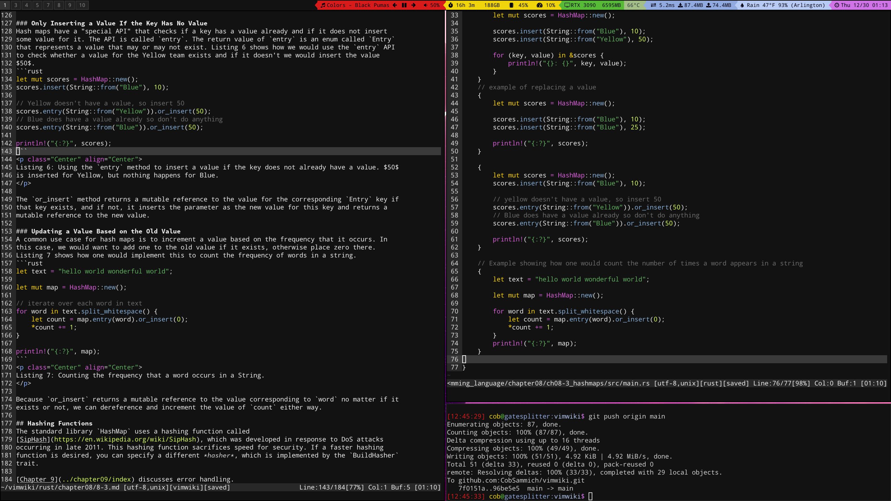

# CobSammich's Dotfiles

Contains various dotfiles used on my personal Arch Linux system.

* Window Manager: i3-gaps
* Terminal Emulator: Alacritty (and sometimes xfce4-terminal)
* Bar: [i3status-rust](https://github.com/greshake/i3status-rust)

## Structure
This repository has the following structure:

* `home/` contains all the configuration files that should be stored in your home directory: `~`.
* `config/` contains all the configuration files that should be stored in `~/.config`
* `update_dotfiles.sh` is used to update the system dotfiles from this repository using symbolic
links.

> Note: I decided to hide API keys by making sample files that remove the API keys. Thus, when
updating all dotfiles, I must replace the API key placeholder with the actual API key.

## Usage
After pulling or updating any files in this repository, run the shell script `./update_dotfiles.sh`
to create symbolic links of all files in this repo on your system.

## Showcase
Here are a couple images showing how my system looks. This first image shows how my desktop and
i3bar look alongside my Arch desktop's neofetch output.

And here is another screenshot showing my active window for learning Rust.

